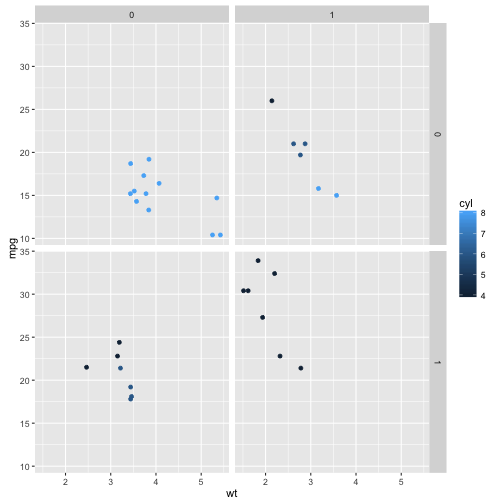

MPGPredictor
========================================================
author: Soumya Kanti Das Bhaumik
date: April 30, 2016

Introduction
========================================================

The MPGPredictor predicts the fuel efficiency of your vehicle on the basis of the following parameters

- Automatic or manual transmission
- Weight
- Number of Cylinders

Training data
========================================================
left: 65%
The training data for the predictor was taken from the `mtcars` dataset
 
***
<font size="6"> 
Inferences
- MPG decreases with increase in weight
- More cylinders also decreases MPG
- Automatic tends to be less efficent than manual
</font> 

Building the model
========================================================
left: 80%

<font size="6"> 
The MPGPredictor predicts on the basis of a linear model of MPG vs weight, transmission and cylinders


```r
fit01 = lm (mpg ~ am + wt + cyl, data = mtcars)
summary(fit01)$coefficients
```

```
              Estimate Std. Error    t value     Pr(>|t|)
(Intercept) 39.4179334  2.6414573 14.9227979 7.424998e-15
am           0.1764932  1.3044515  0.1353007 8.933421e-01
wt          -3.1251422  0.9108827 -3.4308942 1.885894e-03
cyl         -1.5102457  0.4222792 -3.5764148 1.291605e-03
```

The low p-values of `wt` and `cyl` indicate that there is a high confidence in the correlation between them and the MPG.
</font> 

The Application
========================================================
How to run the application
- Go to the following URL:
- Enter the transmission, weight and number of cylinders
- The server provides the estimated MPG
